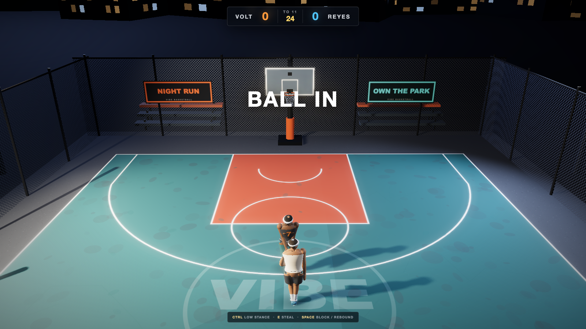

# Vibe Basketball

A playable street-basketball game with 1v1 and a four-shooter 3-Point Contest,
running entirely in the browser.
This is an AI-assisted learning project: the goal was to explore how far a
small Three.js game can go without a game engine, physics package, downloaded
character models, or animation packs.



## What is in the game

- 1v1 to 11, win by 2, with a 15-point cap
- Check ball, make-it-take-it, a 24-second clock, take-backs, steals, blocks,
  rebounds, out-of-bounds and rematches
- Dribble moves, burst exits, gathers, pump fakes, jumpers, layups and dunks
- A timing-based shot meter and physical rim, backboard and net reactions
- An AI opponent plus an AI-vs-AI attract mode
- A four-shooter 3-Point Contest with 1–4 local players, five racks, a selectable
  money rack, two deep balls, CPU watch/skip, a top-three Final and official
  advancement/championship shoot-off clocks
- Runtime-generated athletes, basketball poses, court art and WebAudio effects
- An original unbranded Vibe rack and deep-ball pedestal with source, LODs and
  cold-import acceptance evidence

The public repository intentionally ships no proprietary character files,
motion-capture clips or third-party animation packs. Player geometry, rigging
and motion are generated from the source in `src/entities/rig.js` and
`src/anim/animator.js`.

## Stack

- Three.js
- Vite
- Playwright for the browser smoke check and capture harness

## Run locally

```bash
npm install
npm run dev
```

Open <http://localhost:5173>.

Useful URL options:

- `?mode=1v1` — open 1v1 directly
- `?mode=three-point` — open the 3-Point Contest directly
- `?attract=1` — AI vs AI
- `?debug=1` — show the state overlay
- `?clean=1` — hide the help panel
- `?cam=0` through `?cam=4` — select a camera preset
- `?lite=1` — disable shadows and post-processing
- `?slow=0.35` — slow the simulation for motion review

## Controls

- `WASD` move
- `Shift` sprint
- `Ctrl` physical play / defensive stance
- Tap the arrow keys for handle moves; hold an arrow for a hop shot or finish
- `Space` pump fake, or hold and release to shoot
- `K` spin
- `E` steal
- `C` cycle the camera
- `P` toggle attract mode
- `R` rematch
- `F3` debug overlay

The start menu also includes a complete **How to Play** screen. In the contest,
choose the local player count, select a money rack when each player comes up,
then hold and release `Space` to shoot; running and rack changes are automatic.
Press `Enter` during a CPU turn to simulate to the next local player.

## Verify

```bash
npm run build
npm run test:smoke
npm run test:three-point-rules
npm run test:three-point
```

The smoke check starts its own Vite server and verifies that the athletes remain
fully procedural with no character-model or animation-pack requests. The
contest probes cover menu navigation, pass-and-play order, rack scoring,
watch/skip determinism, elimination, both shoot-off clocks and the champion path.

## License

Project source and original generated content are available under the
[MIT License](LICENSE). Dependencies retain their own licenses; see
[THIRD_PARTY_NOTICES.md](THIRD_PARTY_NOTICES.md).
